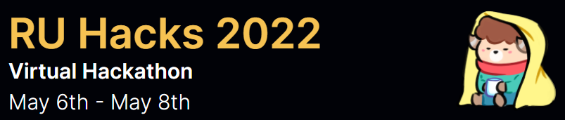

# RU Hacks 2022
### Official submission to RU Hacks 2022 by Team WinNow

 

## Inspiration💡
Since the COVID outbreak, most events, fests and workshops have taken a turn to hosting virtually. In case of universities, where multiple clubs host events through out the year, people miss out on a lot of good opportunities as there is no uniform place to keep track of what's happening. Every QR code that is placed around the campus don't get noticed as people aren't generally looking for them. Secondly, some of these QR codes might be for a past event which creates even more confusion as to which to rely on. 

## What it does 🧭
Our solution, generates QR codes with the help of Openscreen, but also ensures that these are put to good use. For the example of an university, for all the events that clubs host, our platform will be necessary for them to generate dynamic QR codes. Once these QR codes are generated, our React web app uses the details provided to us by the clubs to showcase events on one single web page. People can use this to keep track of all events and directly apply for them by scanning the QR code from our webpage from the comfort of their homes. 

## How we built it 🔧
Using Openscreen we generate dynamic QR values, which are then fetched through the Openscreen API to our local host. The QR data is fetched as an object which contains various details ranging from QR id, date of creation etc. When our Frontend (React Web app) is opened by the user, the data is fetched from the QR-images section and it displays the name of the events, date of the events and the QR image which you can scan to enroll yourself in the events.  

## Tech Stack 🔨
1. React.js
2. Node.js
3. Openscreen API
4. JavaScript
5. Git
6. GitHub

## Challenges we ran into 🏃‍♂️

1. To get the QR as images instead of object files with data was a challenge for us.
2. To post the QR codes from Openscreen to our React web application was difficult as we faced multiple issues in the integration. 

## Accomplishments that we're proud of 🏅
1. Created a working prototype where the QR codes are succesfully fetched and posted to our front end. 
2. Build the project use MERN stack which is our first time working in a MERN stack project. 

## What we learned 🧠
1. Openscreen method of QR generation.
2. Openscreen API to fetch and post QR codes to our Webapplication.
3. Node.js packages and their use. 

## What's next ⏭

1. Sort the events in ascending order so people can understand the timelines better. 
2. Build the same Prototype as a Hub so multiple universities/organisations can use our platform. 
